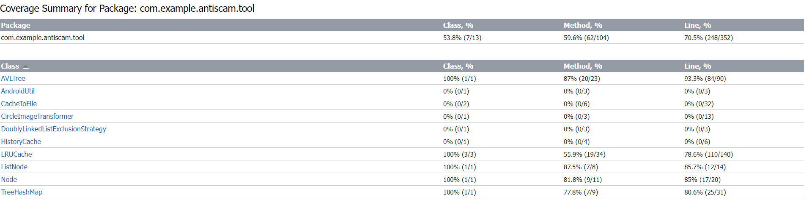
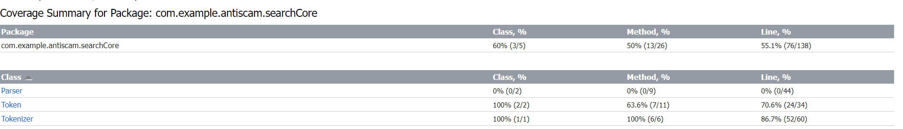

# [G32] Report

## Table of Contents

1. [Team Members and Roles](#team-members-and-roles)
2. [Summary of Individual Contributions](#summary-of-individual-contributions)
3. [Application Description](#application-description)
4. [Application UML](#application-uml)
5. [Application Design and Decisions](#application-design-and-decisions)
6. [Summary of Known Errors and Bugs](#summary-of-known-errors-and-bugs)
7. [Testing Summary](#testing-summary)
8. [Implemented Features](#implemented-features)
9. [Team Meetings](#team-meetings)
10. [Conflict Resolution Protocol](#conflict-resolution-protocol)

## Administrative
- Firebase Repository Link: https://console.firebase.google.com/project/antiscam-5b447/
   - Confirm: I have already added comp21006442@gmail.com as a Developer to the Firebase project prior to due date.
- Two user accounts for markers' access are usable on the app's APK (do not change the username and password unless there are exceptional circumstances. Note that they are not real e-mail addresses in use):
   - Username: comp2100@anu.edu.au	Password: comp2100
   - Username: comp6442@anu.edu.au	Password: comp6442

## Team Members and Roles
The key area(s) of responsibilities for each member

| UID        |        Name        |                               Role |
|:-----------|:------------------:|:-----------------------------------|
| u7558707   |     Zhaoyun Xu     |  Project Manager, Developer |
| u7618794   |     Yuke Huang     |  UI Designer, Developer |
| u7566045   |     Yijing Jia     |  UI Designer, Developer |
| u7551551   |    Junzhe Huang    |  Developer, Tester |


## Summary of Individual Contributions

1. **u7551551 Junzhe Huang** I contribute 25% of the code. Here are my contributions:
   
    - Features Implementation
    1. [Data Search] Hard
    2. [User Chat] Hard
    - Code Implementation
        1. bean
            1. `ChatModel.class` [All of class] https://gitlab.cecs.anu.edu.au/u7558707/ga-23s2/-/blob/main/src/app/src/main/java/com/example/antiscam/bean/ChatModel.java
        2. searchCore
            1. `Token.class` [All of class] https://gitlab.cecs.anu.edu.au/u7558707/ga-23s2/-/blob/main/src/app/src/main/java/com/example/antiscam/searchCore/Token.java
            2. `TokenHelper.class` [All of class] https://gitlab.cecs.anu.edu.au/u7558707/ga-23s2/-/blob/main/src/app/src/main/java/com/example/antiscam/searchCore/TokenHelper.java
            3. `Tokenizer.class` [All of class] https://gitlab.cecs.anu.edu.au/u7558707/ga-23s2/-/blob/main/src/app/src/main/java/com/example/antiscam/searchCore/Tokenizer.java
        3. ui
            1. `MainMenu.class` [search()] https://gitlab.cecs.anu.edu.au/u7558707/ga-23s2/-/blob/main/src/app/src/main/java/com/example/antiscam/act/MainMenu.java
            2. `SearchResultActivity.class` [search()] https://gitlab.cecs.anu.edu.au/u7558707/ga-23s2/-/blob/main/src/app/src/main/java/com/example/antiscam/act/SearchResultActivity.java
            3. `ChatActivity.class` [All of class] https://gitlab.cecs.anu.edu.au/u7558707/ga-23s2/-/blob/main/src/app/src/main/java/com/example/antiscam/act/ChatActivity.java
        4. manager
            1. `SearchDataManager.class` [All of class] https://gitlab.cecs.anu.edu.au/u7558707/ga-23s2/-/blob/main/src/app/src/main/java/com/example/antiscam/manager/SearchDataManager.java
    
    - Code Design:
        1. Tokenizer pattern
        2. Singleton pattern
        3. Database table design
        4. chat design
    - UI Design:
        1. All of UI design of chat
    - Report Writing:
        1. Application Design and Decisions (partial - 25%)
        2. Summary of Individual Contributions
    
2. **u7618794, Yuke Huang**  I have 25% contribution, as follows: 
  - **Code Contribution in the final App**
    - Basic Features - DataFiles: [scamCase.json](https://gitlab.cecs.anu.edu.au/u7558707/ga-23s2/-/blob/main/src/app/src/main/assets/scamCase.json)
    - Custom Feature - FB-Persist: Extension: 
        - `ScamCaseDao.java` [add and get data from firestore interface](https://gitlab.cecs.anu.edu.au/u7558707/ga-23s2/-/blob/main/src/app/src/main/java/com/example/antiscam/dataclass/ScamCaseDao.java#L13-22)
        - `ScamCaseDaoImpl.java`[add and get data from firestore implementation](https://gitlab.cecs.anu.edu.au/u7558707/ga-23s2/-/blob/main/src/app/src/main/java/com/example/antiscam/dataclass/ScamCaseDaoImpl.java#L66-148)
    
    **UI**
    
    - Add post activity: 
      - [AddPostPage.java](https://gitlab.cecs.anu.edu.au/u7558707/ga-23s2/-/blob/main/src/app/src/main/java/com/example/antiscam/act/AddPostPage.java)
      - [activity_add_post_page.xml](https://gitlab.cecs.anu.edu.au/u7558707/ga-23s2/-/blob/main/src/app/src/main/res/layout/activity_add_post_page.xml)
      - [items in each Spinner](https://gitlab.cecs.anu.edu.au/u7558707/ga-23s2/-/blob/main/src/app/src/main/res/values/strings.xml#L30-160)
    - Case details activity: 
       - [CaseDetail.java](https://gitlab.cecs.anu.edu.au/u7558707/ga-23s2/-/blob/main/src/app/src/main/java/com/example/antiscam/act/CaseDetail.java)
       - [activity_case_detail.xml](https://gitlab.cecs.anu.edu.au/u7558707/ga-23s2/-/blob/main/src/app/src/main/res/layout/activity_case_detail.xml)
    - main menu activity - floating action button:
       - [initFltBtn()](https://gitlab.cecs.anu.edu.au/u7558707/ga-23s2/-/blob/main/src/app/src/main/java/com/example/antiscam/act/MainMenu.java#L210-256)
       - [Fab design](https://gitlab.cecs.anu.edu.au/u7558707/ga-23s2/-/blob/main/src/app/src/main/res/layout/activity_main_menu.xml#L116-126)
       - [ic_add_2.xml](https://gitlab.cecs.anu.edu.au/u7558707/ga-23s2/-/blob/main/src/app/src/main/res/drawable/ic_add_2.xml)
    - Submit post successfully page:
       - [SubmitSuccessPage.java](https://gitlab.cecs.anu.edu.au/u7558707/ga-23s2/-/blob/main/src/app/src/main/java/com/example/antiscam/act/SubmitSuccessPage.java)
       - [activity_submit_success_page.xml](https://gitlab.cecs.anu.edu.au/u7558707/ga-23s2/-/blob/main/src/app/src/main/res/layout/activity_submit_success_page.xml)
       <br><br>
       **other**
    - implements Parcelable to User class:
        - [CREATOR](https://gitlab.cecs.anu.edu.au/u7558707/ga-23s2/-/blob/main/src/app/src/main/java/com/example/antiscam/bean/User.java#L30-46)
        - [describeContents() and writeToParcel()](https://gitlab.cecs.anu.edu.au/u7558707/ga-23s2/-/blob/main/src/app/src/main/java/com/example/antiscam/bean/User.java#L72-82)
    - implements Parcelable to ScamCase class:
        - [CREATOR](https://gitlab.cecs.anu.edu.au/u7558707/ga-23s2/-/blob/main/src/app/src/main/java/com/example/antiscam/bean/ScamCase.java#L59-82)
        - [describeContents() and writeToParcel()](https://gitlab.cecs.anu.edu.au/u7558707/ga-23s2/-/blob/main/src/app/src/main/java/com/example/antiscam/bean/ScamCase.java#L180-215)
    - implements Parcelable to ScamCaseWithUser class:
        - [CREATOR](https://gitlab.cecs.anu.edu.au/u7558707/ga-23s2/-/blob/main/src/app/src/main/java/com/example/antiscam/bean/ScamCaseWithUser.java#L33-49)
        - [describeContents() and writeToParcel()](https://gitlab.cecs.anu.edu.au/u7558707/ga-23s2/-/blob/main/src/app/src/main/java/com/example/antiscam/bean/ScamCaseWithUser.java#L59-76)
    - ScamCaseCardAdapter 
       - [setOnClickListener()](https://gitlab.cecs.anu.edu.au/u7558707/ga-23s2/-/blob/main/src/app/src/main/java/com/example/antiscam/adapter/ScamCaseCardAdapter.java#L44-52)
       - [OnClickListener for the item view](https://gitlab.cecs.anu.edu.au/u7558707/ga-23s2/-/blob/main/src/app/src/main/java/com/example/antiscam/adapter/ScamCaseCardAdapter.java#L72-81)
    
  - **Code and App Design**
    - I involved in the DAO design pattern.
    - I designed the [case detail page](https://gitlab.cecs.anu.edu.au/u7558707/ga-23s2/-/blob/main/src/app/src/main/res/layout/activity_case_detail.xml), [add post page](https://gitlab.cecs.anu.edu.au/u7558707/ga-23s2/-/blob/main/src/app/src/main/res/layout/activity_add_post_page.xml), [submit successfully page](https://gitlab.cecs.anu.edu.au/u7558707/ga-23s2/-/blob/main/src/app/src/main/res/layout/activity_submit_success_page.xml) and [floating action button](https://gitlab.cecs.anu.edu.au/u7558707/ga-23s2/-/blob/main/src/app/src/main/res/layout/activity_main_menu.xml#L116-126) in main menu.
    
  - **Others**: 
    
    - responsible for 8 meeting minutes writing.
    - design the [application icon figure](https://gitlab.cecs.anu.edu.au/u7558707/ga-23s2/-/blob/main/src/app/src/main/res/drawable/icon.png) and implement the adaptive icons: [ic_launcher_foreground.webp](https://gitlab.cecs.anu.edu.au/u7558707/ga-23s2/-/blob/main/src/app/src/main/res/mipmap-xxxhdpi/ic_launcher_foreground.webp), [ic_launcher_background.xml](https://gitlab.cecs.anu.edu.au/u7558707/ga-23s2/-/blob/main/src/app/src/main/res/values/ic_launcher_background.xml)
    - create the [UML class diagram](https://gitlab.cecs.anu.edu.au/u7558707/ga-23s2/-/blob/main/items/media/UML-6442.png)
    - write [Conflict Resolution Protocol](https://gitlab.cecs.anu.edu.au/u7558707/ga-23s2/-/blob/main/items/Conflict_Resolution_Protocol.pdf)
    - report: responsible for Application Description, Team management, and conflict Resolution Protocol.
    - features video edit
    - presentation slides

3. **u7566045, Yijing Jia**  I have 25% contribution, as follows: <br>
  - **Code Contribution in the final App**
    
    - Feature Implementation
    
      1. [LoadShowData] medium
      2. [Data-Profile] easy
      4. [P2P-Block] medium
      5. [Data-Persist] (Extension Part)
    - Code Implementation
    
      1. UI
    
         1. Mainmenu
            1. [MainMenu.java](https://gitlab.cecs.anu.edu.au/u7558707/ga-23s2/-/blob/main/src/app/src/main/java/com/example/antiscam/act/MainMenu.java)
            2. [activity_main_menu.xml](https://gitlab.cecs.anu.edu.au/u7558707/ga-23s2/-/blob/main/src/app/src/main/res/layout/activity_main_menu.xml)
            3. [mainmenu_cardlist](https://gitlab.cecs.anu.edu.au/u7558707/ga-23s2/-/blob/main/src/app/src/main/res/layout/mainmenu_cardlist.xml)
    
         2. Profile
            1. [Profile.java](https://gitlab.cecs.anu.edu.au/u7558707/ga-23s2/-/blob/main/src/app/src/main/java/com/example/antiscam/act/Profile.java)
            2. [activity_profile.xml](https://gitlab.cecs.anu.edu.au/u7558707/ga-23s2/-/blob/main/src/app/src/main/res/layout/activity_profile.xml)
    
         3. UpdateProfile
            1. [UpdateProfile.java](https://gitlab.cecs.anu.edu.au/u7558707/ga-23s2/-/blob/main/src/app/src/main/java/com/example/antiscam/act/UpdateProfile.java)
            2. [activity_update_profile.xml](https://gitlab.cecs.anu.edu.au/u7558707/ga-23s2/-/blob/main/src/app/src/main/res/layout/activity_update_profile.xml)
            3. [profile_cardlist.xml](https://gitlab.cecs.anu.edu.au/u7558707/ga-23s2/-/blob/main/src/app/src/main/res/layout/profile_cardlist.xml)
         4. ChatActivity
            1. Method [initBlock()](https://gitlab.cecs.anu.edu.au/u7558707/ga-23s2/-/blob/main/src/app/src/main/java/com/example/antiscam/act/ChatActivity.java#L225-270)
            2. Method [blockUser()](https://gitlab.cecs.anu.edu.au/u7558707/ga-23s2/-/blob/main/src/app/src/main/java/com/example/antiscam/act/ChatActivity.java#L275-297)
    
      2. dao
    
         1. [blockDao](https://gitlab.cecs.anu.edu.au/u7558707/ga-23s2/-/blob/main/src/app/src/main/java/com/example/antiscam/dao/BlockDao.java)
         2. [blockDaoImpl](https://gitlab.cecs.anu.edu.au/u7558707/ga-23s2/-/blob/main/src/app/src/main/java/com/example/antiscam/dao/BlockDaoImpl.java)
         3. ScamCaseDao
            1. [getAllScamCase()](https://gitlab.cecs.anu.edu.au/u7558707/ga-23s2/-/blob/main/src/app/src/main/java/com/example/antiscam/dao/ScamCaseDaoImpl.java#L46-65)
            2. [getDocumentId()](https://gitlab.cecs.anu.edu.au/u7558707/ga-23s2/-/blob/main/src/app/src/main/java/com/example/antiscam/dao/ScamCaseDao.java#L33-37)
         4. ScamCaseDaoImpl 
            1. [getAllScamCase()](https://gitlab.cecs.anu.edu.au/u7558707/ga-23s2/-/blob/main/src/app/src/main/java/com/example/antiscam/dao/ScamCaseDaoImpl.java#L43-62)
            2. [getDocumentId()](https://gitlab.cecs.anu.edu.au/u7558707/ga-23s2/-/blob/main/src/app/src/main/java/com/example/antiscam/dao/ScamCaseDaoImpl.java#L158-179)
         5. UserDao
            1. [getUserByEmail](https://gitlab.cecs.anu.edu.au/u7558707/ga-23s2/-/blob/main/src/app/src/main/java/com/example/antiscam/dao/UserDao.java#L10)
         6. UserDaoImpl
            1. [getUserByEmail](https://gitlab.cecs.anu.edu.au/u7558707/ga-23s2/-/blob/main/src/app/src/main/java/com/example/antiscam/dao/UserDaoImpl.java#L43-62)
    
      3. adapter
    
         1. [ScamCaseCardAdapter - 60%](https://gitlab.cecs.anu.edu.au/u7558707/ga-23s2/-/blob/main/src/app/src/main/java/com/example/antiscam/adapter/ScamCaseCardAdapter.java)
         2. [ScamCaseCardProfileAdapter](https://gitlab.cecs.anu.edu.au/u7558707/ga-23s2/-/blob/main/src/app/src/main/java/com/example/antiscam/adapter/ScamCaseCardProfileAdapter.java)
    
      4. manager
    
         1. [UserInfoManager](https://gitlab.cecs.anu.edu.au/u7558707/ga-23s2/-/blob/main/src/app/src/main/java/com/example/antiscam/manager/UserInfoManager.java)
    
      5. bean
    
         1. [BlockModel](https://gitlab.cecs.anu.edu.au/u7558707/ga-23s2/-/blob/main/src/app/src/main/java/com/example/antiscam/bean/BlockModel.java)
    
      6. tool
         1. [AndroidUtil](https://gitlab.cecs.anu.edu.au/u7558707/ga-23s2/-/blob/main/src/app/src/main/java/com/example/antiscam/tool/AndroidUtil.java)
  - **Code and App Design** 
    
    - Design Pattern: dao and adapter design parttern.
    - UI design: Designed UI style and created all the [UI demo](https://gitlab.cecs.anu.edu.au/u7558707/ga-23s2/-/blob/main/items/UI_Demo.zip) using Axure.
  - **Others**:  

    - Report Writing
      1. Implementation of features
      2. Individual Contributions


4. **u7558707, Zhaoyun Xu**  I have 25% contribution, as follows: <br>
  - **Code Contribution in the final App**
    - **Code Contribution in the final App**
    
      - Feature Implementation

        1. [LogIn] easy
        2. [Data-Deletion] medium
        3. [FB-Persist] medium
      - Code Implementation
    
        1. UI
    
           - Login and Logout
             - [ChatActivity.java](https://gitlab.cecs.anu.edu.au/u7558707/ga-23s2/-/blob/main/src/app/src/main/java/com/example/antiscam/act/ChatActivity.java) [All of class]
             - [activity_login.xml ](https://gitlab.cecs.anu.edu.au/u7558707/ga-23s2/-/blob/main/src/app/src/main/res/layout/activity_login.xml)[All of class]
             - [logout_button.xml](https://gitlab.cecs.anu.edu.au/u7558707/ga-23s2/-/blob/main/src/app/src/main/res/layout/logout_button.xml) [All of class]
           - History
             - [History.java](https://gitlab.cecs.anu.edu.au/u7558707/ga-23s2/-/blob/main/src/app/src/main/java/com/example/antiscam/act/History.java) [All of class]
             - [activity_history.xml](https://gitlab.cecs.anu.edu.au/u7558707/ga-23s2/-/blob/main/src/app/src/main/res/layout/activity_history.xml) [All of class]
             - [history_cardlist.xml](https://gitlab.cecs.anu.edu.au/u7558707/ga-23s2/-/blob/main/src/app/src/main/res/layout/history_cardlist.xml) [All of class]
        2. dao
           - ScamCaseUserCombine
             - [Method: loadScamCases()](https://gitlab.cecs.anu.edu.au/u7558707/ga-23s2/-/blob/main/src/app/src/main/java/com/example/antiscam/dao/ScamCaseUserCombine.java#L22-65)
           - UserDao
             - [Method: getAllUsers()](https://gitlab.cecs.anu.edu.au/u7558707/ga-23s2/-/blob/main/src/app/src/main/java/com/example/antiscam/dao/UserDao.java#L11)
           - UserDaoImpl
             1. [Method: getAllUsers()](https://gitlab.cecs.anu.edu.au/u7558707/ga-23s2/-/blob/main/src/app/src/main/java/com/example/antiscam/dao/UserDaoImpl.java#L64-85)
        3. manager
    
           - [FirebaseAuthManager.java](https://gitlab.cecs.anu.edu.au/u7558707/ga-23s2/-/blob/main/src/app/src/main/java/com/example/antiscam/manager/FirebaseAuthManager.java) [All of class]
        4. bean
    
           - [User.java](https://gitlab.cecs.anu.edu.au/u7558707/ga-23s2/-/blob/main/src/app/src/main/java/com/example/antiscam/bean/User.java) 
        5. tool
           - [AVLTree.java](https://gitlab.cecs.anu.edu.au/u7558707/ga-23s2/-/blob/main/src/app/src/main/java/com/example/antiscam/tool/AVLTree.java) [All of class]
           - [CacheToFile.java](https://gitlab.cecs.anu.edu.au/u7558707/ga-23s2/-/blob/main/src/app/src/main/java/com/example/antiscam/tool/CacheToFile.java) [All of class]
           - [DataLoadCallback.java](https://gitlab.cecs.anu.edu.au/u7558707/ga-23s2/-/blob/main/src/app/src/main/java/com/example/antiscam/tool/DataLoadCallback.java) [All of class]
           - [DoublyLinkedListExclusionStrategy.java](https://gitlab.cecs.anu.edu.au/u7558707/ga-23s2/-/blob/main/src/app/src/main/java/com/example/antiscam/tool/DoublyLinkedListExclusionStrategy.java) [All of class]
           - [HistoryCache.java](https://gitlab.cecs.anu.edu.au/u7558707/ga-23s2/-/blob/main/src/app/src/main/java/com/example/antiscam/tool/HistoryCache.java) [All of class]
           - [LRUCache.java](https://gitlab.cecs.anu.edu.au/u7558707/ga-23s2/-/blob/main/src/app/src/main/java/com/example/antiscam/tool/LRUCache.java) [All of class]
           - [ListNode.java](https://gitlab.cecs.anu.edu.au/u7558707/ga-23s2/-/blob/main/src/app/src/main/java/com/example/antiscam/tool/ListNode.java) [All of class]
           - [Node.java](https://gitlab.cecs.anu.edu.au/u7558707/ga-23s2/-/blob/main/src/app/src/main/java/com/example/antiscam/tool/Node.java) [All of class]
           - [TreeHashMap.java](https://gitlab.cecs.anu.edu.au/u7558707/ga-23s2/-/blob/main/src/app/src/main/java/com/example/antiscam/tool/TreeHashMap.java) [All of class]
        6. Test
           - [AVLTreeTest.java](https://gitlab.cecs.anu.edu.au/u7558707/ga-23s2/-/blob/main/src/app/src/test/java/com/example/antiscam/AVLTreeTest.java) [All of class]
           - [LRUCacheTest.java](https://gitlab.cecs.anu.edu.au/u7558707/ga-23s2/-/blob/main/src/app/src/test/java/com/example/antiscam/LRUCacheTest.java) [All of class]
           - [ListNodeTest.java](https://gitlab.cecs.anu.edu.au/u7558707/ga-23s2/-/blob/main/src/app/src/test/java/com/example/antiscam/ListNodeTest.java) [All of class]
           - [NodeTest.java](https://gitlab.cecs.anu.edu.au/u7558707/ga-23s2/-/blob/main/src/app/src/test/java/com/example/antiscam/NodeTest.java) [All of class]
    
      - **Code and App Design** 
    
        - Design Pattern: singleton and iterator design pattern.
        - Implement AVL tree data structure and relevant custom `LRUCache` and `DoublyLinkedList`data structure.
    
      - **Others**:  
    
        - Report Writing
          1. Data Structures
          2. Design Patterns
          3. Testing Summary
          4. Individual Contributions
    
        - As the team leader, I allocate tasks, manage project assignments, and assist team members in addressing challenging code implementations and resolving bugs.


## Application Description


Our AntiScam application is a user-driven platform designed to combat scams by allowing users to share their experiences, provide scam alerts, and engage in meaningful communication with the content creator. 
1. Users can [post details of scam incidents](application screenshot/add_post.png) including the type of scam, title, payment method, monetary losses incurred and so on.
2. The [search functionality](application screenshot/search_for_title.png) enables easy access to specific scam cases, helping users find relevant information quickly. 
3. The app features a [private messaging](application screenshot/chat.png) system that fosters direct communication between users, facilitating the exchange of insights and clarification on scam-related issues. 
4. We prioritize user privacy and have implemented a ['block'](application screenshot/chat.png) feature, granting users control over their communication preferences by allowing them to prevent specific users from sending direct messages. 
5. On the [user's profile](application screenshot/my_profile.png) page, users can view their browsing history, and the last post read will show on the top of history section.
6. User also have choice to [delete all the history records](application screenshot/delete_history_records.png) and [delete their previous posts](application screenshot/delete_post.png).
7. We also offer personalized services, allowing users to click on their [avatar](application screenshot/change_avatar.png) to change it to other photo.
8. The add post button in the [main menu](application screenshot/main_menu.png) is draggable, user can drag it along the right edge.

Our app aims to create an informed community, protecting individuals from potential scams.
<br><br>


<br><br>
### Application Use Cases and or Examples

**Target Users: Public**
- **Use Case 1: Searching for Scam Case**
   - **User:** John
   - **Scenario:** John receives a suspicious email advertising a product at an unbelievably low price, significantly lower than the market price. He is unsure whether this is a scam or a genuine bargain.
   - **Action:** John opens the AntiScam app and uses the search feature to look for product and service scams.
  - **Result:** John finds some posts that exactly match his scenario, which confirms that this is a scam, and he saves $150.
   <br><br>
- **Use Case 2: Knowing the Latest Scam Tactics**
   - **User:** Sarah
   - **Scenario:** Sarah is curious about the latest scam tactics.
   - **Action:** She accesses the AntiScam app and search for scam cases by interested title or scam types. 
   - **Result:** Sarah find there are various of Scam Tactics, and knowing it in advance can help her to avoid being scammed.
   <br><br>

**Target Users: Victims**
- **Use Case 3: Reporting a Scam Case and Alerting Others**
    - **User:** Amy
    - **Scenario:**  After identifying that she has encountered a social media scam, Amy notices that the script used in the chat is slightly different from the cases she has seen before.
    - **Action:** Amy clicks the plus button on the main menu page and fills in the required information, including title, lost amount, scam type, and more. She then describes the detailed process she experienced and shares the new scam script.
    - **Result:**  The AntiScam app records her scam case, and when she returns to the main page, she finds that her post is already showed at the top, and all other users can see the new post.
    <br><br>
- **Use Case 4: Seek help and potential ways to get money back**
    - **User:** Vera
    - **Scenario:** Vera feels hopeless because she just lost a large amount of money by a scam.
    - **Action:** Vera opens the AntiScam app and add a post about her experience. In the description part, she includes the willing to get help. Then she submits it.
    - **Result:**  Other users see her post and message her privately. Some users provide really useful methods which help Vera to calm down. But Vera encounter one user is up to no good. She decides to block that user from message her.
    <br><br>
- **Use Case 5: Seek Comfort and Social needs**
   - **User:** Emily
   - **Scenario:** Emily faced a romance scam recently, she cries every day and want to find someone to talk with.
   - **Action:** She opens AntiScam app and search for romance scams.
   - **Result:** She finds one user called Isabella also face romance scam recently,she messages Isabella and share her story, they become good friends.
   <br><br>

**Target Users:authorities such as government agencies, police and so on**
- **Use Case 6: make announcement about recent scams**
    - **User:** government agencies, police and so on
    - **Scenario:** These authorities want to make official announcements about recent scams to inform and alert the public.
    - **Action:** They log in to the AntiScam application and create a new announcement. 
    - **Result:**  The announcement is published on the AntiScam platform, and users can access this important information to stay informed and protected against scams.
      <br><br>

**Staff to maintain the application**
- **Use Case 7: make announcement about recent scams**
    - **User:** Moderator
    - **Scenario:** A user post a new scam case in AntiScam app.
    - **Action:** They review recent posts to ensure this user adhere to community guidelines.
    - **Result:** Inappropriate content is removed, and other users can not see it.
  <br><br>
<hr> 

### Application UML

 <br><br>
<hr>

## Code Design and Decisions

<hr>

### Data Structures

*We used the following data structures in our project:*

1. *LRU cache (A custom implemented cache mechanism)*
   * *Objective:*
      * To efficiently store and retrieve information about scam cases that users have read, we implemented a custom TreeHashMap in LRUCache. Each time a user reads a new scam case, its details are stored in this TreeHashMap. Additionally, we use a custom doubly-linked list to keep track of the order in which users have read the scam cases, allowing the historical interface to display these cases in the order of reading. This design effectively forms an LRUCache structure with a fixed capacity of 100 cases. Once this capacity is filled, the earliest read case will be pushed to make room for a new scam case upon its addition.
      * Every activity which is trying to use cache firstly use [getInstance()](https://gitlab.cecs.anu.edu.au/u7558707/ga-23s2/-/blob/main/src/app/src/main/java/com/example/antiscam/tool/HistoryCache.java#L16), then use [getCache()](https://gitlab.cecs.anu.edu.au/u7558707/ga-23s2/-/blob/main/src/app/src/main/java/com/example/antiscam/tool/HistoryCache.java#L24) and [setCache()](https://gitlab.cecs.anu.edu.au/u7558707/ga-23s2/-/blob/main/src/app/src/main/java/com/example/antiscam/tool/HistoryCache.java#L28) to get and update cache in the local files of phones or simulators.
      * When any scam case is deleted in the `Profile`, the local cache will also remove it, making the local history works fine.
   * *Code Locations: defined in [Class LRUCache](https://gitlab.cecs.anu.edu.au/u7558707/ga-23s2/-/blob/main/src/app/src/main/java/com/example/antiscam/tool/LRUCache.java)*
   * *Reasons:*
      * Frequently accessed data can be retrieved rapidly from memory, avoiding the need to reload from a database or another store, thus significantly reducing data access latency. Users can conveniently view the scam cases they've most recently read without the wait of extensive loading or retrieval processes.
2. *TreeHashMap (A custom implemented hash map)*
   * *Objective:*
     * TreeHashMap is created in `TreeHashMap.java`, then`LRUCache` use it in [line 10](https://gitlab.cecs.anu.edu.au/u7558707/ga-23s2/-/blob/main/src/app/src/main/java/com/example/antiscam/tool/LRUCache.java#L18). When users reads case information in application, we store and update cache, treehashmap and doubly-linked list.
   * *Code Locations: defined in [Class TreeHashMap](https://gitlab.cecs.anu.edu.au/u7558707/ga-23s2/-/blob/main/src/app/src/main/java/com/example/antiscam/tool/TreeHashMap.java)*
   * *Reasons:*
     * In the ideal scenario where no hash collisions are present, operations like querying, inserting, and deleting within our cache are remarkably efficient with a time complexity of ***O*(1)**. This design choice ensures an fast response for data retrieval, insertion, and removal from the cache.
     * By adding a custom TreeHashMap to our LRU Cache for key-value pair storage, we gain the advantage of both structured hierarchical storage and quick access.
3. *AVL Tree(A custom implemented data structure)*
   * *Objective:*
     * AVLTree is used as the underlying data structure for hash buckets in TreeHashMap, with every hash map has 10 avl trees in total.
   * *Code Locations: defined in [Class AVLTree](https://gitlab.cecs.anu.edu.au/u7558707/ga-23s2/-/blob/main/src/app/src/main/java/com/example/antiscam/tool/AVLTree.java)*
   * *Reasons:*
     * AVL trees offer a consistent time complexity of ***O(log(n))*** for operations like queries, insertions, and deletions. Even in cases where hash collisions occur in hash map, the retrieval, addition, and removal of data from hash buckets remain fast due to the AVL tree's self-balancing property.
     * Compared to linked lists and standard binary search trees, AVL trees ensure a more balanced structure, preventing the tree from becoming too skewed on extreme cases. 
     * AVL trees strike a balance between operation speed and complexity. AVL trees has better querying efficiency compared to red-black trees, they slightly lag behind in insertion and deletion. However, this trade-off is often worthwhile, especially when considering the added complexity of implementing red-black trees.
     *  B-trees have their own advantages in large datasets or databases because they store data in large nodes, AVL trees offer a more straightforward implementation for memory. As we only store 100 cases, while 10 cases for every avl tree in average,  AVL trees become the best choice for smaller datasets.
4. *Doubly-linked List*
   * *Objective:*
     * In LRU Cache, a doubly-linked list is implemented to track the order in which scams are read.
   * *Code Locations: defined in [Class DoublyLinkedList](https://gitlab.cecs.anu.edu.au/u7558707/ga-23s2/-/blob/main/src/app/src/main/java/com/example/antiscam/tool/LRUCache.java#L99)*
   * *Reasons:*
     * The inherent structure of a doubly-linked list enables efficient removal of nodes from any position and addition to the front ensuring that the cache operations remain rapid and the least recently used items are easily identified and removed when the cache is full.
5. *Json*
   * *Objective:*
     * We store cache as local files in json format by using `GSON`.
   * *Code Locations: defined in Method [saveCacheToInternalStorage](https://gitlab.cecs.anu.edu.au/u7558707/ga-23s2/-/blob/main/src/app/src/main/java/com/example/antiscam/tool/CacheToFile.java#L22), [loadCacheFromInternalStorage](https://gitlab.cecs.anu.edu.au/u7558707/ga-23s2/-/blob/main/src/app/src/main/java/com/example/antiscam/tool/CacheToFile.java#L32)*
   * *Reasons:*
     * The inherent structure of a doubly-linked list enables efficient removal of nodes from any position and addition to the front ensuring that the cache operations remain rapid and the least recently used items are easily identified and removed when the cache is full.

<hr>

### Design Patterns

*We used the following design patterns in our project:*

1. *DAO*
   * *Objective: In our project, we implemented the DAO (Data Access Object) pattern in our data querying and storage classes.*
   * *Code Locations: defined in [BlockDao.java](https://gitlab.cecs.anu.edu.au/u7558707/ga-23s2/-/blob/main/src/app/src/main/java/com/example/antiscam/dao/BlockDao.java), [BlockDaoImpl.java](https://gitlab.cecs.anu.edu.au/u7558707/ga-23s2/-/blob/main/src/app/src/main/java/com/example/antiscam/dao/BlockDaoImpl.java), [ScamCaseDao.java](https://gitlab.cecs.anu.edu.au/u7558707/ga-23s2/-/blob/main/src/app/src/main/java/com/example/antiscam/dao/ScamCaseDaoImpl.java), [ScamCaseDaoImpl.java](https://gitlab.cecs.anu.edu.au/u7558707/ga-23s2/-/blob/main/src/app/src/main/java/com/example/antiscam/dao/ScamCaseDaoImpl.java)*, [UserDao.java](https://gitlab.cecs.anu.edu.au/u7558707/ga-23s2/-/blob/main/src/app/src/main/java/com/example/antiscam/dao/UserDao.java), [UserDaoImpl.java](https://gitlab.cecs.anu.edu.au/u7558707/ga-23s2/-/blob/main/src/app/src/main/java/com/example/antiscam/dao/UserDaoImpl.java)
   * *Reasons:*
      * The main reason for adopting this pattern is that it makes data access logic away from our business logic(like in Adapter or Activity). This separation allows us for more flexibility when it comes to modifying or extending our data sources, at the same time, ensuring that our business logic remains unchanged. Moreover, by using the DAO pattern, our code becomes more readable and maintainable, which makes debugging more easily.
2. *Singleton*
   * *Objective: We implemented the Singleton pattern in our data querying and storage classes to guarantee a single instance throughout the application. We've also implemented it on the LRUCache.*
   * *Code Locations: defined in [BlockDaoImpl.java](https://gitlab.cecs.anu.edu.au/u7558707/ga-23s2/-/blob/main/src/app/src/main/java/com/example/antiscam/dao/BlockDaoImpl.java), [ScamCaseDaoImpl.java](https://gitlab.cecs.anu.edu.au/u7558707/ga-23s2/-/blob/main/src/app/src/main/java/com/example/antiscam/dao/ScamCaseDaoImpl.java)*, [UserDaoImpl.java](https://gitlab.cecs.anu.edu.au/u7558707/ga-23s2/-/blob/main/src/app/src/main/java/com/example/antiscam/dao/UserDaoImpl.java), [HistoryCache.java](https://gitlab.cecs.anu.edu.au/u7558707/ga-23s2/-/blob/main/src/app/src/main/java/com/example/antiscam/tool/HistoryCache.java)
   * *Reasons:*
     * The Singleton pattern plays an important role in efficiently managing resources within an application. By ensuring that only one instance of a dao class exists, we can effectively control our application's memory consumption, thus reducing overhead and boosting the application's performance. Although Firebase utilizes a connection pool to solve issues related to resource contention and data inconsistency, our primary motivation was to economize memory usage and improve operational performance. This approach enhances object management, eliminates the unnecessary replication of objects or connections, and results in smoother, more responsive application behavior.
3. *Interator*
   * *Objective: We implemented the Iterator design pattern on our doubly-linked list to provide a unified way to traverse through its elements.*
   * *Code Locations: defined in [Class LRUCache.DoublyLinkedList.DLLIterator](https://gitlab.cecs.anu.edu.au/u7558707/ga-23s2/-/blob/main/src/app/src/main/java/com/example/antiscam/tool/LRUCache.java#L235-267)*
   * *Reasons:*
     * The Iterator pattern offers several advantages when applied to a doubly-linked list. Firstly, it abstracts the underlying data structure, allowing for a consistent way to access elements of the list. This enables potential future modifications to the list without altering other function. Secondly, the Iterator enhances code readability by offering a standard nethod to iterate, reducing the complexities of traversal. Lastly, it provides a safer way to read through the list by guarding against concurrent modifications, which might lead to unpredictable danger.

<hr>

### Parser

### <u>Grammar(s)</u>
Designed with a tokenizer-based approach for parsing grammar, utilizing common string prefixes to reduce query time, minimize unnecessary string comparisons, resulting in higher query efficiency than a hash tree.

Production Rules:

- %=2000    ::= Query amount
- #=title   ::= Query title
- @=xxx@anu.edu.au ::= Query username
- %>2000   ::= Greater-than query
- %>=2000  ::= Greater-than or equal to query
- %<2000   ::= Less-than query
- %<=2000  ::= Less-than or equal to query
- %!=2000  ::= Not-equal-to query
- %=2000&#=title ::= AND query
- %=2000||#=title ::= OR query

### <u>Tokenizers and Parsers</u>

- Token:

  - Operator:

    ```
    Token.USEREMAIL(@)
    Token.TITLE(#)
    Token.AMOUNT(%)
    Token.SCAMTYPE($)
    Token.NE:(!=)
    Token.LE:(<=)
    Token.GE:(>=)
    Token.GT:(>)
    Token.LT:(<)
    Token.EQ:(=)
    Token.AND:(&)
    Token.OR:(|)
    TOKEN.STR:(String)
    ```

​	We collect user search strings, incorporates them into tokenizer parsing, generating corresponding tokens, and storing corresponding values. Then, generates corresponding Firebase Filter syntax based on these tokens.

- Advantages:

  - Text Preprocessing: The tokenizer can convert raw text into discrete language units such as words or sub-words. Tokenization allows for the transformation of text into a form that computers can understand and process.

  - Language Understanding: Tokenizers can help us better understand the meaning of the text. By dividing the text into language units, we can more easily identify the structure of sentences, the meaning of words, and their relationships.

  - Feature Extraction: In natural language processing tasks, tokenizers can serve as a part of feature extraction. By dividing the text into words or phrases, we can extract various statistical features, such as word frequency, part of speech, etc.

  - Multilanguage Support: Tokenizers can handle multiple languages, including English, Chinese, French, etc. For cross-language text processing tasks, tokenizers are indispensable tools. Different languages have different tokenization rules and characteristics.

  - Customized Rules: Tokenizers often provide functionality for customized rules, which can be adjusted according to specific needs.

<br>

<hr>

## Implemented Features

[features.mp4](features.mp4)

### Basic Features
1. [LogIn]. Log in refers to the process where users enter their username and password on a login page to verify their identity and grant them access privileges. User information is stored in Firebase. If the username and password entered on the login page are correct, the user logs in successfully and is redirected to the app's main page. Otherwise, a toast message pops up, indicating that the username or password is incorrect.

   Two pre-existing accounts have been added to Firebase: 

   Username: [comp6442@anu.edu.au](mailto:comp6442@anu.edu.au), Password: comp6442 

   Username: [comp2100@anu.edu.au](mailto:comp2100@anu.edu.au), Password: comp2100  (easy)<br>

   * Code: 

     Class [act/LoginActivity](https://gitlab.cecs.anu.edu.au/u7558707/ga-23s2/-/blob/main/src/app/src/main/java/com/example/antiscam/act/LoginActivity.java) 

     Class [manager/FirebaseAuthManage](https://gitlab.cecs.anu.edu.au/u7558707/ga-23s2/-/blob/main/src/app/src/main/java/com/example/antiscam/manager/FirebaseAuthManager.java)

2. [DataFiles].2,500 scam cases were created, including information such as post user, post date, scam type, title, description, etc. The data files were stored in JSON format and then batch-imported into Firebase as a collection. (easy)

   * Code

     Data File [scamCase.json](https://gitlab.cecs.anu.edu.au/u7558707/ga-23s2/-/blob/main/src/app/src/main/assets/scamCase.json), 

     Class LoginActivity

     ​	- Method [updateFirestore](https://gitlab.cecs.anu.edu.au/u7558707/ga-23s2/-/blob/main/src/app/src/main/java/com/example/antiscam/act/LoginActivity.java#L164-224)

   * Link to the Firebase repo: [scam_cases](https://console.firebase.google.com/project/antiscam-5b447/firestore/data/~2Fscam_cases)

3. [LoadShowData]. When a user is logged in and redirected to the main menu, scam cases listed on the main menu will be loaded from Firebase every 10 seconds. Since each scam case contains both scam case information and user information, we load and combine them together, presenting them as a single scam case card. If a new post is added, upon returning to the main page, the data on the main page will also be refreshed. If a user clicks on a scam case card, they will be directed to the detailed information page for that scam case. The browse history will be recorded, users could find their browse history in profile-History page. Additionally, the user's avatar will also be loaded from Firebase. (Medium)

   - Code

     Class [act/MainMenu](https://gitlab.cecs.anu.edu.au/u7558707/ga-23s2/-/blob/main/src/app/src/main/java/com/example/antiscam/act/MainMenu.java)

     Class [act/CaseDetail](https://gitlab.cecs.anu.edu.au/u7558707/ga-23s2/-/blob/main/src/app/src/main/java/com/example/antiscam/act/CaseDetail.java)

     Class [act/History](https://gitlab.cecs.anu.edu.au/u7558707/ga-23s2/-/blob/main/src/app/src/main/java/com/example/antiscam/act/History.java)

     Class [adapter/ScamCaseCardAdapter](https://gitlab.cecs.anu.edu.au/u7558707/ga-23s2/-/blob/main/src/app/src/main/java/com/example/antiscam/adapter/ScamCaseCardAdapter.java)

     Class [dao/ScamCaseDao](https://gitlab.cecs.anu.edu.au/u7558707/ga-23s2/-/blob/main/src/app/src/main/java/com/example/antiscam/dao/ScamCaseDao.java)

     Class [dao/ScamCaseDaoImpl](https://gitlab.cecs.anu.edu.au/u7558707/ga-23s2/-/blob/main/src/app/src/main/java/com/example/antiscam/dao/ScamCaseDaoImpl.java)

     Class [dao/ScamCaseUserCombine](https://gitlab.cecs.anu.edu.au/u7558707/ga-23s2/-/blob/main/src/app/src/main/java/com/example/antiscam/dao/ScamCaseUserCombine.java)

     Class [dao/UserDao](https://gitlab.cecs.anu.edu.au/u7558707/ga-23s2/-/blob/main/src/app/src/main/java/com/example/antiscam/dao/UserDao.java)

     Class [dao/UserDaoImpl](https://gitlab.cecs.anu.edu.au/u7558707/ga-23s2/-/blob/main/src/app/src/main/java/com/example/antiscam/dao/UserDaoImpl.java)

     Class [manager/UserInfoManager](https://gitlab.cecs.anu.edu.au/u7558707/ga-23s2/-/blob/main/src/app/src/main/java/com/example/antiscam/manager/UserInfoManager.java)

     Class [bean/ScamCase](https://gitlab.cecs.anu.edu.au/u7558707/ga-23s2/-/blob/main/src/app/src/main/java/com/example/antiscam/bean/ScamCase.java)
     
     Class [bean/User](https://gitlab.cecs.anu.edu.au/u7558707/ga-23s2/-/blob/main/src/app/src/main/java/com/example/antiscam/bean/User.java)
     
     Class [bean/ScamCaseWithUser](https://gitlab.cecs.anu.edu.au/u7558707/ga-23s2/-/blob/main/src/app/src/main/java/com/example/antiscam/bean/ScamCaseWithUser.java)
     

4. [Search] Users are able to search for scam case information on app. Search feature utilises the Tokenizer and Parser. Combined searches are supported. (medium)

   - Search token, combine symbol and compare symbol
   
     Token and search target
   
     - token: @, search target: user email
     - token: #, search target: title
     - token: %, amount
     - token: $, scam type
   
     The symbols '&' (for 'and') and '|' (for 'or') are used, as well as the comparison symbols '=', '<',  '>', '>=', '<=' and so on. 
   
   - Code
   
      Class act/MainMenu
   
      ​	- Method [search()](https://gitlab.cecs.anu.edu.au/u7558707/ga-23s2/-/blob/main/src/app/src/main/java/com/example/antiscam/act/MainMenu.java#L261-276)
   
      Class [act/SearchResultActivity](https://gitlab.cecs.anu.edu.au/u7558707/ga-23s2/-/blob/main/src/app/src/main/java/com/example/antiscam/act/SearchResultActivity.java)
   
      Class [searchCore/Token](https://gitlab.cecs.anu.edu.au/u7558707/ga-23s2/-/blob/main/src/app/src/main/java/com/example/antiscam/searchCore/Token.java)
   
      Class [searchCore/Parser](https://gitlab.cecs.anu.edu.au/u7558707/ga-23s2/-/blob/main/src/app/src/main/java/com/example/antiscam/searchCore/Parser.java)
   
      Class [searchCore/Tokenizer](https://gitlab.cecs.anu.edu.au/u7558707/ga-23s2/-/blob/main/src/app/src/main/java/com/example/antiscam/searchCore/Tokenizer.java)
   
      Class [manager/SearchDataManager](https://gitlab.cecs.anu.edu.au/u7558707/ga-23s2/-/blob/main/src/app/src/main/java/com/example/antiscam/manager/SearchDataManager.java)
   


### Custom Features
Feature Category: Greater Data Usage, Handling and Sophistication <br>
1. [Data-Profile]. A user profile page has been created, which includes the user's profile image and username. Users can also modify their profile image and user name, by clicking image or username users will be redirected to update profile page.  (easy)
   
   * Code:
   
     Class [act/Profile](https://gitlab.cecs.anu.edu.au/u7558707/ga-23s2/-/blob/main/src/app/src/main/java/com/example/antiscam/act/Profile.java) 
   
     Class [act/UpdateProfile](https://gitlab.cecs.anu.edu.au/u7558707/ga-23s2/-/blob/main/src/app/src/main/java/com/example/antiscam/act/UpdateProfile.java)
   
     Class [adapter/ScamCaseCardProfileAdapter](https://gitlab.cecs.anu.edu.au/u7558707/ga-23s2/-/blob/main/src/app/src/main/java/com/example/antiscam/adapter/ScamCaseCardProfileAdapter.java)
   
     Class [tool/CircleImageTransformer](https://gitlab.cecs.anu.edu.au/u7558707/ga-23s2/-/blob/main/src/app/src/main/java/com/example/antiscam/tool/CircleImageTransformer.java)
   
2. [Data-Deletion]. Users can delete posts they've created. When a user clicks 'Delete,' the corresponding data will be removed from the Firebase scam_case collection, at the same time, the data will also be deleted from AVLTree (We implemented LRU and a custom underlying data structure of LRU named "TreeHashMap"). After deletion, user posts list will be refreshed. (medium)

   - Code:

     Class act/Profile 

     ​	- Method [onDelBtnClick](https://gitlab.cecs.anu.edu.au/u7558707/ga-23s2/-/blob/main/src/app/src/main/java/com/example/antiscam/act/Profile.java#L129-160)

     ​	- Method [deletePost](https://gitlab.cecs.anu.edu.au/u7558707/ga-23s2/-/blob/main/src/app/src/main/java/com/example/antiscam/act/Profile.java#L293-313)
   
     Class tool/LRUCache
   
     ​	- Method [remove](https://gitlab.cecs.anu.edu.au/u7558707/ga-23s2/-/blob/main/src/app/src/main/java/com/example/antiscam/tool/LRUCache.java#L80-85)

Feature Category: Firebase Integration 
3. [FB-Auth] Use Firebase to implement User Authentication.  (easy)

   * Code: 

     Class [act/LoginActivity](https://gitlab.cecs.anu.edu.au/u7558707/ga-23s2/-/blob/main/src/app/src/main/java/com/example/antiscam/act/LoginActivity.java)

4. [FB-Persist] Use Firebase to persist all data used in app. User could add posts and the data will be stored in Firebase. Without restarting, when other users swipe down, the scam case list will be updated synchronously as the Firebase is updated. This means that users will be able to see the instant updates from another user. (hard)

   - Code:

     Class [act/AddPostPage](https://gitlab.cecs.anu.edu.au/u7558707/ga-23s2/-/blob/main/src/app/src/main/java/com/example/antiscam/act/AddPostPage.java)

     Class [act/SubmitSuccessPage](https://gitlab.cecs.anu.edu.au/u7558707/ga-23s2/-/blob/main/src/app/src/main/java/com/example/antiscam/act/SubmitSuccessPage.java)

     Class dao/ScamCaseDao

     ​	- Method [updateNextId](https://gitlab.cecs.anu.edu.au/u7558707/ga-23s2/-/blob/main/src/app/src/main/java/com/example/antiscam/dao/ScamCaseDao.java#L25-28)

     Class dao/ScamCaseDaoImpl

     ​	- Method [addScamCase](https://gitlab.cecs.anu.edu.au/u7558707/ga-23s2/-/blob/main/src/app/src/main/java/com/example/antiscam/dao/ScamCaseDaoImpl.java#L95-105)

     ​	- Method [getNextId](https://gitlab.cecs.anu.edu.au/u7558707/ga-23s2/-/blob/main/src/app/src/main/java/com/example/antiscam/dao/ScamCaseDaoImpl.java#L113-134)

     ​	- Method [updateNextId](https://gitlab.cecs.anu.edu.au/u7558707/ga-23s2/-/blob/main/src/app/src/main/java/com/example/antiscam/dao/ScamCaseDaoImpl.java#L142-152)

     Class act/Mainmenu

     ​	- Method [swipeRefresh](https://gitlab.cecs.anu.edu.au/u7558707/ga-23s2/-/blob/main/src/app/src/main/java/com/example/antiscam/act/MainMenu.java#L153-163)

     ​	- Method [reloadMainmenuScamCase](https://gitlab.cecs.anu.edu.au/u7558707/ga-23s2/-/blob/main/src/app/src/main/java/com/example/antiscam/act/MainMenu.java#L168-177)

Feature Category: Peer to Peer Messaging

5. [P2P-DM] Provide users with the ability to message each other directly in private. All messages will be instantly received by both parties in the private conversation. (hard)

   - Code:

     Class [act/ChatActivity](https://gitlab.cecs.anu.edu.au/u7558707/ga-23s2/-/blob/main/src/app/src/main/java/com/example/antiscam/act/ChatActivity.java)

     Class [adapter/ChatAdapter](https://gitlab.cecs.anu.edu.au/u7558707/ga-23s2/-/blob/main/src/app/src/main/java/com/example/antiscam/adapter/ChatAdapter.java)
     
     Class [bean/ChatModel](https://gitlab.cecs.anu.edu.au/u7558707/ga-23s2/-/blob/main/src/app/src/main/java/com/example/antiscam/bean/ChatModel.java)

6. [P2P-Block] Provide users with the ability to ‘block’ and prevent another user from direct messaging them. However, users can still send private messages to users they have blocked. Users who have been blocked will be unable to send private messages to the person who blocked them. (medium)

   - Code:

     Class act/ChatActivity

     ​	- Method [initBlock](https://gitlab.cecs.anu.edu.au/u7558707/ga-23s2/-/blob/main/src/app/src/main/java/com/example/antiscam/act/ChatActivity.java#L225-270)

     ​	- Method [blockUser](https://gitlab.cecs.anu.edu.au/u7558707/ga-23s2/-/blob/main/src/app/src/main/java/com/example/antiscam/act/ChatActivity.java#L275-297)

     Class [dao/BlockManager](https://gitlab.cecs.anu.edu.au/u7558707/ga-23s2/-/blob/main/src/app/src/main/java/com/example/antiscam/dataclass/BlockManager.java)

     Class [bean/BlockModel](https://gitlab.cecs.anu.edu.au/u7558707/ga-23s2/-/blob/main/src/app/src/main/java/com/example/antiscam/bean/BlockModel.java)

<hr>

### Surprised Features

- Suprised feature is not implemented

  <br> <hr>

## Summary of Known Errors and Bugs

1. *Bug in Firestore:*

   - *When user add new post and submit successfully, the firestore will store this object in the scam_cases collection, but a extra field "scalability" will automaticly add to this object with value 0. This bug will not affect the data show in the case detail page.*

2. *Bug in History:*

   - When a user ***A*** deletes his created scam case ***S*** on one device, the record of ***S*** still appears in the browsing history of other users' devices.

3. *Bug in Chats:*

   - When the device is new and opens `Chats` page, it may directly go back to `MainMenu` page. The `Chats` page will still work after that.

   - When a user ***A*** blocks another user ***B***, if he leaves `Chats` page and directly goes into `Chats ` Page again from `Profile` Page, the `block` button will stay unchanged, this is the same when he unblocks another user and same condition with `unblock` button. Clicking the unchanged button will **cause error**.

     The button can be changed by leave both `Chats` Page and `Profile` Page, which means starting from the `MainMenu` Page again.
   
   - For logged-in users, the name displayed in "Chats" is the user display name from Firebase authentication. However, for other users, the name displayed in "Chats" is the username stored in the user table.

<br> <hr>


## Testing Summary

We've done testing through two ways: white box, black box testing. And we've found bugs and solved some of them by debugging or logging to the console.

- White box testing

  In white box testing, we utilized the emulator to execute all our methods and code. Given our familiarity with the expected outcomes of the code, we tailored our tests accordingly. For example, we inspected the UI layout to confirm it aligned with our intended design. At the same time, we tested the search functionality by setting various search parameters and ensuring the results matched our expectations. This approach helped us detect and rectify certain overlooked errors.

  We managed to successfully test some functionalities like "onCreate" or "onClick". By examining the specifics of the code within these methods, we could check if the appropriate actions were being triggered. For instance, if we clicked the button, we would certainly know if there was an error by looking at the interface and database to check if that's the right function we wanted to achieve.

- Black box testing:

  - We wrote some black box testing by Junit to ensure our tokenizer, parser functions are implemented correctly. The codes we tested are as follows:
    - [AVLTreeTest.java](https://gitlab.cecs.anu.edu.au/u7558707/ga-23s2/-/blob/main/src/app/src/test/java/com/example/antiscam/AVLTreeTest.java)
    - [CodeTest.java](https://gitlab.cecs.anu.edu.au/u7558707/ga-23s2/-/blob/main/src/app/src/test/java/com/example/antiscam/CodeTest.java)
    - [LRUCacheTest.java](https://gitlab.cecs.anu.edu.au/u7558707/ga-23s2/-/blob/main/src/app/src/test/java/com/example/antiscam/LRUCacheTest.java)
    - [ListNodeTest.java](https://gitlab.cecs.anu.edu.au/u7558707/ga-23s2/-/blob/main/src/app/src/test/java/com/example/antiscam/ListNodeTest.java)
    - [NodeTest.java](https://gitlab.cecs.anu.edu.au/u7558707/ga-23s2/-/blob/main/src/app/src/test/java/com/example/antiscam/NodeTest.java)
    - [TokenizerTest.java](https://gitlab.cecs.anu.edu.au/u7558707/ga-23s2/-/blob/main/src/app/src/test/java/com/example/antiscam/TokenizerTest.java)
    
  - The test we wrote is to test most of the functions we are using and track their outputs. For example, in the `LRUCache` class, we wrote several tests to meet our application requirements:

    ```java
    testBasicFunction()  // Tests the fundamental operations of the cache
    testEmptyCache()	// Ensures the cache behaves correctly when it's empty.
    testCacheSizeLimit()	// Checks that the cache does not exceed its predefined size limit.
    testAddWhenFull()	 // Validates that when the cache is full and a new item is added, the least recently used item is correctly added.	
    testGetAll() 	// Tests the ability to retrieve all items in the cache.
    testRemove()	 // Ensures that items can be manually removed from the cache
    testEvictionOrder()	    // Validates the order in which items are added
    testRecentUsage()		 // Checks that accessing an item updates its usage.
    testOverwriteExistingKey()	 // Ensures that if a key already exists in the cache 
    testNullValue()	 // Tests the cache's behavior when null values are added.
    ```

- Test Coverage

  We didn't write any tests for the interfaces, UI classes or database connections, and we have done a test coverage report. The testing classes and functions are in the images:

  - 

  - 

  - We can check the coverage for the classes and files we test:

    | class       | class coverage | method coverage | line coverage |
    | ----------- | -------------- | --------------- | ------------- |
    | AVLTree     | 100%           | 87%             | 93.3%         |
    | LRUCache    | 100%           | 55.90%          | 78.60%        |
    | ListNode    | 100%           | 87.50%          | 85.7%         |
    | Node        | 100%           | 81.80%          | 85%           |
    | TreeHashMap | 100%           | 77.80%          | 80.60%        |
    | Token       | 100%           | 63.60%          | 70.60%        |
    | Tokenizer   | 100%           | 100%            | 86.70%        |
    | Average     | 100%           | 79%             | 79%           |

  - The average coverage is above 70%. And the reason for the low coverage of `LRUCache` is that it contains many inside private class method, which we are not using and not able to test, but these codes are retained for the functionality of `gson`(which can serialize the complex class of `LRUCache` to Json format, which is easy to test and check).

  - To check more detailed, please [Click Here for a detailed Coverage Report](https://gitlab.cecs.anu.edu.au/u7558707/ga-23s2/-/blob/main/items/testCoverage/index.html)

- Debugging and Logging

  In Android Studio, we set breakpoints in our code, which means when the app runs, it will 'pause' at these breakpoints. This allows us to inspect the current state of the app and examine the values of variables. For example, if we want to see the content of a list of scam cases at a particular point in our code, we can set a breakpoint and the debugger will show us the content of that list when it hits the breakpoint.

  Another way we understand what's happening in our app is by using log statements, like `Log.d()`. Think of these as little notes or messages we leave for ourselves. When a piece of code runs, it leaves these messages in the Logcat, a console in Android Studio. For example, after fetching data from the database, we might leave a message saying 'Data got from database'. Later, we can look at Logcat and see this message, helping us confirm that our data fetching code ran successfully. When dealing with firestore database, understanding the sequence in which data is fetched or saved is crucial and hard, as they may asynchronously load. We can use log statements right after database operations. By checking the sequence of log messages, we will understand the order of our database operations.

<br><hr>


## Team Management

### Meetings Records
- *[Team Meeting 1](https://gitlab.cecs.anu.edu.au/u7558707/ga-23s2/-/blob/main/items/Meeting%20materials/meeting1.md)*
- *[Team Meeting 2](https://gitlab.cecs.anu.edu.au/u7558707/ga-23s2/-/blob/main/items/Meeting%20materials/meeting%202.md)*
- *[Team Meeting 3](https://gitlab.cecs.anu.edu.au/u7558707/ga-23s2/-/blob/main/items/Meeting%20materials/meeting%203.md)*
- *[Team Meeting 4](https://gitlab.cecs.anu.edu.au/u7558707/ga-23s2/-/blob/main/items/Meeting%20materials/meeting%204.md)*
- *[Team Meeting 5](https://gitlab.cecs.anu.edu.au/u7558707/ga-23s2/-/blob/main/items/Meeting%20materials/meeting%205.md)*
- *[Team Meeting 6](https://gitlab.cecs.anu.edu.au/u7558707/ga-23s2/-/blob/main/items/Meeting%20materials/meeting%206.md)*
- *[Team Meeting 7](https://gitlab.cecs.anu.edu.au/u7558707/ga-23s2/-/blob/main/items/Meeting%20materials/meeting%207.md)*
- *[Team Meeting 8](https://gitlab.cecs.anu.edu.au/u7558707/ga-23s2/-/blob/main/items/Meeting%20materials/meeting%208.md)*


| No. |    Date    |                Topic                |
|:----|:----------:|:-----------------------------------:|
| 1   | 2023-09-06 |  review of assignment requirements  |
| 2   | 2023-09-07 |        discuss app scenarios        | 
| 3   | 2023-09-08 |       discuss basic features        |
| 4   | 2023-09-10 |         UI tasks allocation         | 
| 5   | 2023-09-14 |      custom features selection      |
| 6   | 2023-09-17 | implement basic and custom features |
| 7   | 2023-10-06 |        review tasks progress        |
| 8   | 2023-10-18 |  report + code review +checklist    |

<br><br>
In addition to these eight meetings, our team have regular stand-up meetings to review the progress of our tasks. Furthermore, whenever a team member encounters challenges or difficulties, we support and help each other. All the team members are good at teamwork, each meeting we can communicate effectively and every groupmates can finish their allocated tasks on time.

<hr>

### Conflict Resolution Protocol
- *[Conflict Resolution Protocol](https://gitlab.cecs.anu.edu.au/u7558707/ga-23s2/-/blob/main/items/Conflict_Resolution_Protocol.pdf)*
